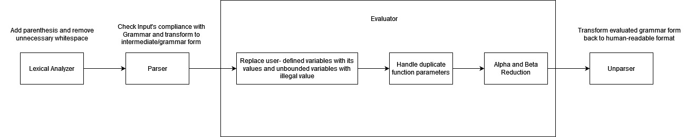

# Lambda Interpreter

# API

This interpreter is using [servant](https://docs.servant.dev/en/stable/) as the web server.

There is only one endpoint in this interpreter:

In local: <br/>
```http://localhost:8080/evaluate```

In production: <br/>
```https://lambdainterpreterbackend-production-db10.up.railway.app/evaluate```

The endpoint is only accepting POST request with JSON as request body with format:

       {
           'expression':[LAMBDA_EXPRESSION],
           'predefined_vars':[PREDEFINED_VARIABLE],
           'maximum_eval':[MAX_EVAL] 
       }

    
* [LAMBDA_EXPRESSION]: Lambda expression to be evaluated (e.g. "a b (lambda a.a)")
* [PREDEFINED_VARIABLE]: Predefined variable in map format with key is variable name and value is expression where variable name binds to (e.g. {"A":"lambda x.x", "B":"x"})
* [MAX_EVAL]: (optional) maximum allowable function application (defualt to 1000) 

# Deployment

This interpreter is deployed on [railway](https://railway.app/)

Website [link](https://lambdainterpreterbackend-production-db10.up.railway.app/) 

# Grammar

This interpreter use the following Grammar rule:

```
    E -> id E | ( [lambda | \] id MoreParams . E' ) E | ( E' ) E | ''
    E' -> id E | ( [lambda | \] id MoreParams . E' ) E | ( E' ) E
    MoreParams -> id MoreParams
```
* id is variable with pattern 
>id = ^[a-zA-Z][a-zA-Z0-9]*$


# Evaluation Process
The following diagram show how lambda expression is evaluated



* Lexical Analyzer<br/>

    In this step unnecessary whitespace will be removed and a parenthesis will be added to enclosed the original lambda expression

* Parser<br/>

    In this stage, the input will be checked against the grammar, if no error found, the input will be transformed into the grammer form.

    This interpreter use [parsec](https://hackage.haskell.org/package/parsec) library to build the parser 

* Evaluation<br/>
    The biggest challange in evaluation step is we need to make sure that no ambigiuty appear during beta-reduction. 

    The following examples show ambiguity in beta-reduction process:
    > (lambda a b. a b) b
    >
    If we performs beta-reduction directly on the above lambda expression then we will get

    > (lambda b. b b)
    >
    Clearly, there is a problem here because we already know that a and b in the original function body bind to different variable in parameter list. However, after beta-reduction a seems to bind to variable b in parameter list.

    To solve this problem, the evaluator in this lambda expression performs 3 stage alpha reduction.

    * Replace all unbounded<br/>

        The first stage is replacing all unbounded by predefined variable (if exist) or illegal value (in this interpreter we replace by x'[unique_number])

    * Replace duplicated parameter list<br/>

        In this interpreter the following expression is legal:
        > (lambda x x.x x)
        >
        if we replace by the formal lambda definition then the above function will become
        > (lambda x. (lambda x.x x))
        >

        However, this kind of function may produce ambigiuty as well, the following example illustrate such case:

        > (lambda s. a ((lambda a s.a s) s))
        >
        As s is a bounded variable if we reduce the inner function that enclosed in parenthesis then we will get the following result.
        > (lambda s.a (lambda s.s s)) 
        >
        We see similar problem again.

        Using the similar approach as unbounded case, this evaluator will replace duplicate paramter definition inside inner function with illegal variable (y'[unique_number])

    * Replace duplicate function parameter in beta reduction<br/>

        The following example illustrates the ambiguity may happen in beta reduction with function as an argument:

        > (lambda b s.a (b s))(lambda a s.a s)
        >

        after beta reduction we get
        > (lambda s.a ((lambda a s.a s) s))
        >

        we get the same expression as the previous ambigiuty example. 

        For this problem, the evaluator will replace the duplicated paramter (and its bounded variable in the function body) with illegal variable (z'[unique_number])

* Unparser<br/>
After performing alpha and beta reduction, as the expression is still in grammar form, the interpreter will transofrom the grammar back to the string format.

# License
Distributed under the MIT License. See [LICENSE](https://github.com/aaaa-qw/lambda_interpreter_backend/blob/main/LICENSE) for more information.
